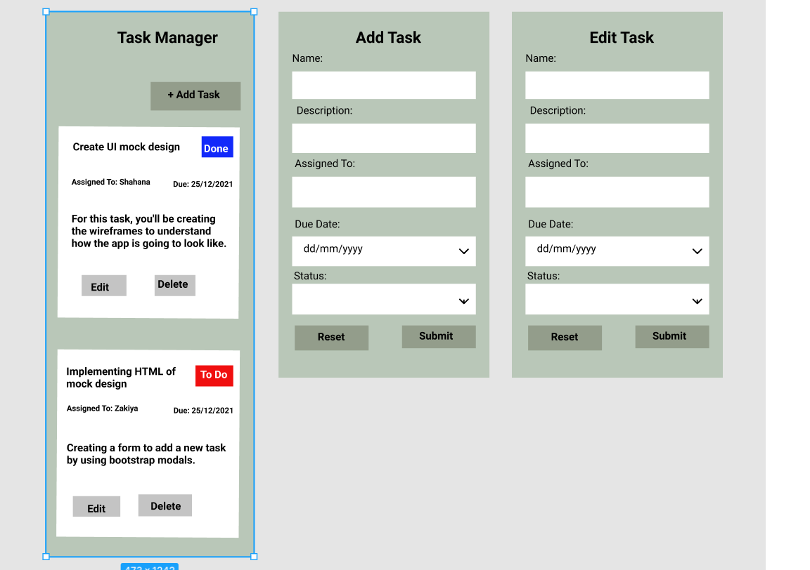

# Task 1: App Wireframes

## Description

For this task, we'll be creating the wireframes to understand how the app is going to look like.

## Walkthrough

### Step 1: Signing up for Figma

 We used Figma to build our wireframe.

> #### Useful Resources for this step
> - [Figma website](https://www.figma.com)
> - [Figma - Minimalistic Todo App Design](https://www.youtube.com/watch?v=crv02kWqfZ0)

### Step 2: Create the UI Mock design

Create the following Mock designs
1. Task list display or task card display page consisting of 
    > - The basic details of the task
    > - Buttons/Links to Edit, Delete the task
    > - A button to Add a new task

2. Creating a new task form consisting of
    > - 'Add Task' heading
    > - Name -> textbox
    > - Description -> textarea
    > - AssignedTo -> textbox
    > - DueDate -> textbox or datepicker [dd/mm/yyyy]
    > - Status -> Dropdown select box [TODO, IN PROGRESS, REVIEW, DONE]
    > - Submit button 
    > - Reset button 

3. Editing a task form consisting of
    > - 'Edit Task' heading
    > - Name -> textbox
    > - Description -> textarea
    > - AssignedTo -> textbox
    > - DueDate -> textbox or datepicker [dd/mm/yyyy]
    > - Status -> Dropdown select box [TODO, IN PROGRESS, REVIEW, DONE]
    > - Submit button 
    > - Reset button 

## Results
   The wireframe we created:
  (https://www.figma.com/file/Rtx0ouUqT6JobmcSTtk304/Untitled?node-id=0%3A1)
  
   